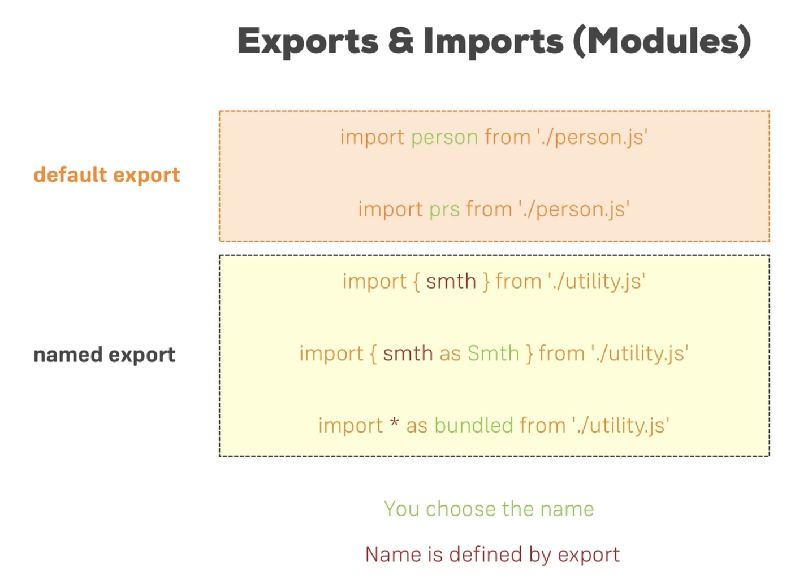

# 컴포넌트

- 여러 컴포넌트들을 만들어 연결함
- App.js가 최상단 루트 컴포넌트이고 그 밑에 트리구조로 여러 컴포넌트들을 만들 수 있음
- 결국 index.js가 렌더링 하는 것은 App.js
- 컴포넌트를 만들때는 첫 시작 글자를 대문자로 작성
- 컴포넌트는 결국 html을 반환하는 js 함수! 함수 형식으로 작성됨
- 컴포넌트 안 html 요소를 작성할 때 jsx의 코드 조각마다 반드시 루트 요소가 필요
  ⇒ 즉 jsx에서는 하나의 루트요소만 있어야함!

# JSX 소개

> `$ npx create-react-app react-complete-guide`

⇒ 리액트 프로젝트 시작, 관련 파일 자동으로 만들어지고 리액트 개발자 서버가 실행됨

> ` $ npm start` ⇒ 개발 서버 오픈

> `$ npm crtl + c` ⇒ 개발 서버 오픈 취소

- index.js 파일 - ReactDom을 import 해옴 라이브러리를 불러오는 과정임
- ReactDom의 내장 메서드로 render를 사용하여 App 컴포넌트를 렌더링
- public 폴더에 index.html이 존재
- App은 컴포넌트, index.js에서는 App 컴포넌트를 렌더링
- App 컴포넌트 안에는 함수 형태의 코드가 존재하고 export 할 수 있음
- App은 무언가를 반환함 → 바로 html 파일
- App은 JSX 구문으로 되어 있음
- JSX는 JS 안에있는 html을 말함.
- 개발 서버를 오픈하고 개발자 도구 안 static/js 폴더 안을 보면 여러 JS 파일이 있음
- 이곳에는 여러 코드가 있는데 리액트 라이브러리 소스 코드를 비롯한 리액트 패키지 코드임
- 이 파일들이 JSX 구문을 작성하면 브라우저에서 읽을 수 있는 코드로 변환해줌

# 리액트 기초 및 작동방식

- 컴포넌트는 기본적으로 사용자에 의해 정의된 커스텀된 HTML 요소
- 선언적 접근 방식 → 리액트는 목표 상태(state)를 정의하고 화면에 보이는 것을 업데이트 하는 DOM 지시사항들을 생성하고 실행하는 역할
- return 안 html 구조 모습이 목표 상태, 즉 결국 그 html 코드를 반환하는 것
- 일반 자바스크립트로 DOM을 만드는 것은 명령형 접근 방식
- 리액트는 목표로 하는 html 요소의 최종 상태를 정의하고 이 요소들을 화면에 불러오기 위한 지시사항들을 뒷단에 생성함 ⇒ 이것이 컴포넌트를 쓰는 이유

## 컴포넌트 활용

- 컴포넌트의 return문 뒤 html 요소를 작성할 때 소괄호로 묶어주어 하나의 문장이라고 의미를 전달할 수 있다.
- CSS를 컴포넌트 파일으 import 하면서 리액트가 렌더링 할 때 CSS파일도 같이 컴파일 할 수 있도록 해야한다.
- JSX 요소의 클래스 이름을 정할 때는 className으로 해야한다. class는 JS의 예약어이기 때문에
- html 요소의 중간에 중괄호를 넣으면 자바스크립트 코드를 그 안에서 실행할 수 있다.(동적인 데이터 출력)
- props를 통해 컴포넌트 간 데이터 전송이 가능하다.
- 그냥 props를 전달할 경우 여러 데이터를 props 하나로 전송이 가능하다.(여기서 props =>모든 속성을 받는 객체가 됨)

> Router 부분 먼저 듣기

# Router

- SPA(Single Page Application)구현해줌
- 페이지가 바뀔 때 마다 새로운 html을 다운 받는 것이 아니라,
- 클라이언트에서 컴포넌트간 경로를 설정하여 속도를 개선할 수 있다.

## Router v6

- 라우터6에서는 exact를 쓰지 않음 -> 경로가 완전히 일치할 경우에만 동작
- 에스터리스크(\*)를 붙인다면 5버전 처럼 사용 가능(url내 관련 모든 페이지 보여줌)
- ㄷㄹ

# section 12: How React Works

## 리액트의 백그라운드 작업 - 리액트가 실제 작동하는 방식

- JS 라이브러리
- 리액트의 핵심은 컴포넌트 -> 내장기능: props 통신, state 관리, 컴포넌트 전체 데이터인 context 등을 바탕으로 Real DOM 렌더링

### 컴포넌트와 Real DOM 간의 통신

- 리액트는 컴포넌트를 관리하고 결국 가상 DOM을 사용하는 것
- 가상 DOM은 최종 렌더링 전 컴포넌트 트리를 결정함
- 가상 DOM: 리액트가 컴포넌트 트리를 통해 구성한 가상 스냅샷
- 가상 DOM과 일치하도록 실제 DOM을 조작!
  **- state나 props, context, 컴포넌트가 변경되면 컴포넌트가 재실행되는데 이를 재평가라 한다.**
- 재평가는 DOM을 다시 렌더링하는 것은 아니다!
- 리액트는 가상 DOM과 실제 DOM의 차이를 비교하여 필요한 부분만 변경, 재평가한다.
  => 최종 스냅샷과 현재의 스냅샷을 실제 DOM에 전달하는 구조!
  **- 새로운 요소를 추가하면 차이를 인식하고 새로운 값만 리액트 DOM에 전달하고 리액트 DOM은 실제 DOM을 업데이트**
  => 리액트 DOM은 전체 DOM을 재렌더링 하지않는다!

- 모든 컴포넌트들은 함수이고 App.jsx가 재평가 될 때 컴포넌트의 자식 컴포넌트들도 재실행, 재평가된다.
  **- 컴포넌트 재평가와 컴포넌트 함수의 재실행이 일어나도 실제 DOM이 다시 렌더링되거나, 변경되는 것은 아니다!**

-> So! 모든 컴포넌트가 줄줄이 재평가 된다면 성능에 영향은 없을까?!?!
영향이 있음!!

> 최적화

- 특정한 상황에서만 해당 컴포넌틀르 재실행하도록 지시할 수 있다.(props 값이 바뀜 등등)

- React.memo
  - 사용: 컴포넌트 export 하는 부분에 React.memo(component)와 같이 사용
  - React.memo는 인자로 들어온 컴포넌트의 모든 props 값들을 확인하고 기존 props값과 비교하여 바뀌었을 때만 컴포넌트를 재실행, 재평가 한다. -> 트리에서 가지를 자르는 느낌!
  - 부모 컴포넌트가 렌더링 될 때 자식 컴포넌트가 그때마다 렌더링 되게 하지 않을 때 사용
- 그렇다면 왜 모든 component에는 사용하지 않을까?!

  - **최적화에는 비용이 따르기 때문에!**
    -> 비용: 기존의 props 값 저장 + 비교하는 작업
    => 어떤 컴포넌트를 최적화 하느냐에 따라 성능 효율이 달라짐!
  - 함수는 하나의 객체!

  - App은 결국 함수이기 때문에 리엑트에 의해 호출되고 재실행됨
    -> 함수 안에 있는 것들은 재사용되지 않고 다시 새로 불러와진다.
  - App 함수가 실행될 때마다 새로운 함수 객체가 생성됨

  - 함수는 개체이고 참조형 데이터이기 때문에 같은 모양을 하더라도 자바스크립트는 다르다고 판단한다.

  - 따라서 리액트에서도 똑같은 함수지만 App 함수가 실행될 때 똑같아 보이는 함수를 다르다고 판단하고 재평가한다.
    -> React.memo 또한 값이 변경된다고 판단함.

- 그렇다면 React.memo는 Props를 통한 객체나 배열, 함수를 가져오는 컴포넌트에서는 사용할 수 없을까?!

> useCallback: 함수를 저장해줌(함수의 재생성을 막는다), 필요할 때만 재생성

- 사용

  - useCallback 훅을 사용하고 첫 번째 인자로 콜백함수 형태로 원하는 함수 전달

  - 두 번째 배열은 의존성 배열을 전달(상태, props, 컨텍스트) -> 빈 배열을 넣으면 콜백함수는 절대 변경되지 않는 다는 것을 의미

- 리액트의 내부에 함수를 저장하고 실행될 때마다 재사용

- useCallback의 두 번째 인자에 빈 배열을 넣을 경우 해당 함수 안에 state 값이 있다면 제대로 작동하지 않는다. useCallback 함수는 외부 변수도 같이 그 상태로 저장하게 되고 처음 App 컴포넌트가 렌더링 될 때의 state 값이 함수와 같이 저장된다. 따라서 함수가 호출될 때는 최신 값이 아니게 된다.
  => 의존성 배열의 state 값을 넣어주면 state 값에 새로운 값이 들어오면 함수를 재생성해서 저장한다.(state 값 항상 최신 값으로 유지 가능)

- useCallback을 통해 함수를 내부에 저장함으로써 리액트는 그 함수를 기억하게 되고 메모리 안에서 항상 같은 객체임을 보증한다. 결국 비교가 가능하게 됨으로써 React.memo가 제 역할을 수행하게됨!

질문

1. props로 함수를 전달하면 전달된 함수의 원본 함수는 다르다?!

> App 컴포넌트가 재생성 된다면 state도 계속 초기화 되는 것 아니냐?!

- 리액트는 상태를 관리하고 컴포넌트와의 연결을 관리한다.
  -> 리액트는 useState와 전달된 기본값은 한 번만 고려되도록 처리한다.(App 컴포넌트가 처음 렌더링 될 때)
  => 상태는 최초의 초기화 이후에는 갱신만 된다!

> state 처리과정

- set 함수로 state를 바꿀 때 즉각적으로 바뀌지 않음!
- 상태 갱신 예약(스케줄링) -> 상태 변화를 지연시킴 왜냐? 다른 우선순위 높은 것들이 있어서
  => 함수 형태로 상태 변경을 하는 것이 좋음! (컴포넌트가 재렌더링 될 때와 상태 변경이 예약되는 시점의 차이를 알고 있어야함)
- 함수 형태가 아니라면 스케줄링에 의해 지연될 수 있기 때문에!

- set함수 -> 바로 바뀌지 않고 상태 갱신 예약 -> 컴포넌트 재실행 -> state 값 최신상태 변경

- 상태 배치 작업: 상태 갱신 작업은 하나의 코드블록 단위로 처리됨

> useMemo로 최적화

- useMemo는 특정 값을 기억한다.
- 객체, 배열, 함수는 렌더링 될 때마다 새롭게 정의된다.
- 따라서 useMemo를 통해 값을 기억하게 하고, 의존성 배열에 특정 값이 바뀌면 값을 갱신하도록 하면 최적화 할 수 있다.
- 다만, useMemo 또한 값을 기억하기 위해 메모리를 쓰기 때문에 비용을 잘 계산해 봐야한다.

# 자바스크립트 기초

## Arrow Function

- function 키워드를 쓰지 않기 때문에 코드가 짧아진다.
- JS에서 this로 인해 생겼던 문제들을 해결해주는 장점을 가짐 -> 화살표 안 this는 항상 정의한 객체를 나타내고, 실행중에 바뀌지 않는다.

## Exports & Imports (Modules)

- export default로 내보내면 -> 가져올 때 이름을 바꿔서 import해도 항상 default로 표시한 것을 참조
- default로 가져오지 않으면 import할 때 중괄호 안에 정확한 이름을 써줘야함!
  

## 클래스

```js
class human {
  constructor() {
    this.gender = 'male'
  }

  printGender() {
    console.log(this.gender)
  }
}

class Person extends human {
  constructor() {
    // 상위 클래스의 생성자 함수를 실행
    super()
    this.name = 'GyeongChan'
    this.gender = 'female'
  }

  printMyName() {
    console.log(this.name)
  }
}

const person = new Person()
person.printMyName()
person.printGender()
```

- 리액트 컴포넌트를 생성하는 방법 중 하나!

## 전개 연산자

> Spread

- 배열 -> 모든 원소들을 꺼내서 대괄호로 새로 생성한 배열에 추가

```js
const numbers = [1, 2, 3]
const newNubers = [...numbers, 4]
console.log(newNumbers) // [1, 2, 3, 4]
```

- 객체 -> 모든 프로퍼티와 값을 꺼내서 중괄호로 새 객체의 키값으로 추가

```js
const person = {
  name: 'GyeongChan',
}

const newPerson {
  ...person,
  age: 28
}
```

> Rest -> 함수의 인수 목록을 배열로 합치는데 사용

```js
const filter = (...args) => {
  return args.filter((el) => el === 1)
}

console.log(filter(1, 2, 3)) // [1]
```

-> ...args로 레스트 연산자를 사용해서 배열을 필터링

## 구조분해할당

- 배열 혹은 객체의 원소를 쉽게 추출하여 변수에 저장 가능하게함
- 객체 코드 예시

```js
{name} = {name: 'GyeongChan', age: 25}
console.log(name) // GyeongChan
console.log(age) // undefined
```

## 객체와 배열은 참조형이 아니다!

```js
const person = {
  name: 'GyeongChan'
}
```
